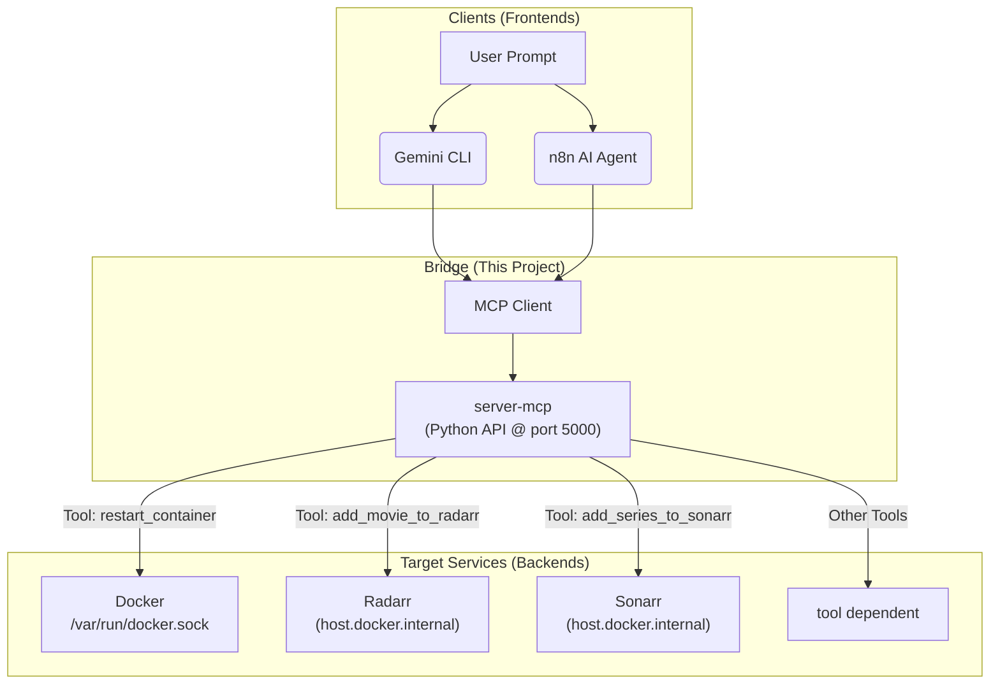

# 🤖 MCP Server - AI Agent Backend


Provides a high-level AI interface (MCP) to control home lab services like Docker, Radarr, and Sonarr using natural language commands. It acts as a secure API bridge between AI brains (like Gemini CLI or n8n) and the server's services (like Docker, service APIs).

## 🔗 Component Services

  * **Server-mcp**: The core Python API server, built with `fastmcp` and running in a Docker container.
  * **Clients (Frontends)**:
      * **Gemini CLI**: Connects remotely via Tailscale for terminal-based control.
      * **n8n**: Connects internally via Docker networking to power automated workflows and AI agents.
  * **Target Services (Backends)**:
      * Docker Daemon
      * Radarr
      * Sonarr<br>
    _and more soon..._

## 🖧 Workflow

This diagram shows the command-and-control flow from a user prompt to the final action.



## ⚙️ Integration Points

This server relies on specific networking to function.

  * **`n8n` → `server-mcp`**:

      * **Method**: `n8n MCP Client` Node
      * **URL**: `http://host.docker.internal:5000/mcp`  _[mcp endpoint url by default given by fastMCP]_
      * **Requires**: `n8n`'s `docker-compose.yml` must have the `extra_hosts: ["host.docker.internal:host-gateway"]` entry.

  * **`Gemini CLI` → `server-mcp`**:

      * **Method**: `~/.gemini/settings.json` config
      * **URL**: `http://myserver:5000/mcp`
      * **Requires**: A working Tailscale connection with the `myserver` hostname.

  * **`server-mcp` → Target Services**:

      * **Docker**: Binds the host's Docker socket (`/var/run/docker.sock`) into the container.
      * **Radarr**: Connects via `http://host.docker.internal:7878` (defined in `docker-compose.yml`'s `environment` and `extra_hosts`).
      * **Sonarr**: Connects via `http://host.docker.internal:8989` (defined in `docker-compose.yml`'s `environment` and `extra_hosts`).

`host.docker.internal` is an internal-only address.It's like an intercom number for an apartment building. It only works if you are already inside the building (i.e., another Docker container on the same server, like n8n).

`myserver` (Tailscale) is the public address (within my private network).Gemini CLI, which is "outside" the building, so it must use the tailscale address to find the server.

## 🗂️ Folder Structure

```
mcp/
└── server-mcp/
    ├── docker-compose.yml  # Manages the container and secrets
    ├── Dockerfile          # Builds the Python container
    ├── server.py           # All tools are defined here
    └── requirements.txt    # Python libraries (fastmcp, arrapi, etc.)
```

## 🚀 Quick Start

1.  **Configure Secrets**:
      * Edit `docker-compose.yml` to add your `RADARR_API_KEY` and `SONARR_API_KEY`.
      * Verify the `RADARR_URL` and `SONARR_URL` ports.
2.  **Configure Preferences**:
      * Edit `server.py` to set your desired `DESIRED_QUALITY_PROFILE` for Radarr and Sonarr.
3.  **Build and Deploy**:
    ```bash
    cd ~/mcp/server-mcp
    docker-compose up -d --build
    ```

## 🛠️ API Tool Reference

The following tools are defined in `server.py` and are automatically discovered by any connected MCP client.

  * **`list_containers()`**: Lists all running containers on the Debian server.
  * **`get_system_uptime()`**: Gets the human-readable system uptime.
  * **`get_disk_usage(path: str = "/")`**: Gets disk usage for a specified path.
  * **`restart_container(name: str)`**: Restarts a specific container by its name.
  * **`add_movie_to_radarr(title: str, year: int = None)`**: Searches for and adds a movie using the hard-coded quality profile.
  * **`add_series_to_sonarr(title: str, year: int = None)`**: Searches for and adds a TV series using the hard-coded quality profile.

_and more as I explore ahead_

---
_Part of my [homelab project](../../README.md)._