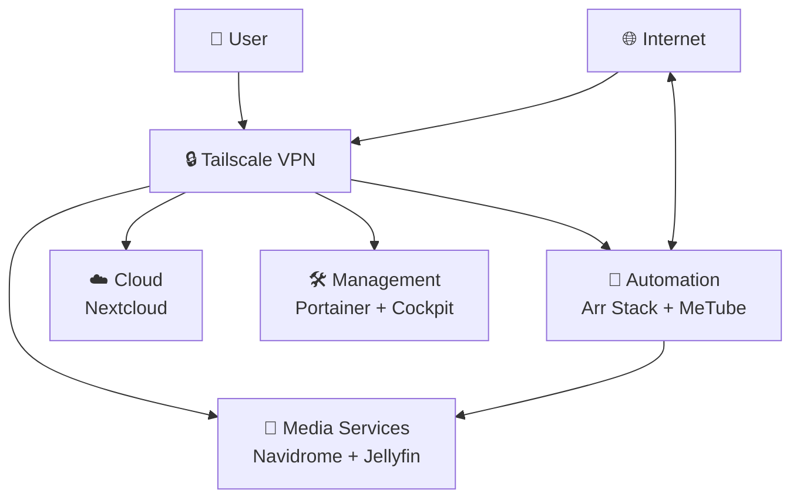

# My Self-Hosted Homelab Journey

_From avoiding YouTube Music ads to building a complete personal cloud infrastructure_  

## 🎯 Origin Story

This project began with a simple frustration: **I wanted to listen to music without YouTube Music's ads and background play restrictions**. What started as a quest for ad-free music evolved into a full-blown homelab hosting multiple services that replace commercial subscriptions with self-hosted alternatives.

### The Evolution:
1. **Music Freedom** (Navidrome) → Replace YouTube Music
2. **Media Consumption** (Jellyfin) → Replace Netflix/Prime Video  
3. **File Sync** (Nextcloud) → Replace Google Drive/Dropbox
4. **Automation** (Arr Stack) → Automate media acquisition
5. **Management** (Portainer/Cockpit) → Professional operations

## 🚀 Live Services

### Media & Entertainment
- **🎵 Navidrome** - Personal Spotify alternative (Port 4533)
- **🎥 Jellyfin** - Personal Netflix replacement (Port 8096) 
- **📥 MeTube** - YouTube audio downloader (Port 5001)

### Media Automation Stack
- **📺 Sonarr** - TV show automation & management
- **🎬 Radarr** - Movie automation & management  
- **🔍 Prowlarr** - Unified indexer manager
- **🌊 qBittorrent** - Torrent client with web UI

### Infrastructure & Management
- **🛠️ Portainer** - Docker container management (Port 9443)
- **📊 Cockpit** - Server system management (Port 9090)
- **🔒 Tailscale** - Secure VPN for remote access
- **☁️ Nextcloud** - File sync, contacts, calendar (Port 8080)

## Infrastructure Overview
A modular, containerized architecture running on repurposed hardware, designed for reliability and easy expansion.

**Hardware Specifications:**
- **Processor**: Intel i3 4th Generation
- **Memory**: 4GB RAM  
- **Storage**: 1TB HDD
- **OS**: Debian 12 Server
- **Network**: Wired Ethernet + Tailscale VPN

**Core Technology Stack:**
- **Containerization**: Docker + Docker Compose
- **Orchestration**: Portainer for container management and Cockpit for server overview and access
- **Networking**: Tailscale for secure remote access
- **Reverse Proxy**: Nginx Proxy Manager for service routing

## 🏗️ Technical Architecture

 
 

>For detailed architecture diagrams, network flows, and service dependencies, see the [architecture documentation](./architecture/README.md).

### Key Architectural Decisions
1. **Container-First Approach**: Each service runs in isolated Docker containers
2. **Unified Storage**: Centralized volume management for easy backups
3. **Secure-by-Default**: VPN-only remote access, service authentication
4. **Automation-Focused**: Media acquisition fully automated via Arr stack

## 📈 The Journey

### Phase 1: Music Freedom
- **Problem**: YouTube Music ads, no background play
- **Solution**: Navidrome + MeTube automation
- **Result**: Complete ad-free music ecosystem

### Phase 2: Media Expansion  
- **Realization**: "I can do this for movies and TV too"
- **Solution**: Jellyfin + Arr stack + qBittorrent
- **Result**: Entire media consumption self-hosted

### Phase 3: Professionalization
- **Need**: Proper management and remote access
- **Solution**: Portainer, Cockpit, Tailscale
- **Result**: Enterprise-grade homelab operations

## 🎯 Key Achievements

- ✅ **Complete ad-free music solution**
- ✅ **Automated media acquisition pipeline**  
- ✅ **Commercial service replacement** (Spotify, Netflix, Google Drive)
- ✅ **Professional infrastructure management**
- ✅ **Secure remote access from anywhere**
- ✅ **All data under personal control**

## 🚧 Future Expansions

- [ ] Network wide Ad Blocker(Pi hole)
- [ ] Home automation (Tweaking with Alexa)
- [ ] Password manager (Vaultwarden)
- [ ] Monitoring (Grafana, Prometheus)
- [ ] Development environments

## 💡 Lessons Learned

This project demonstrates how solving one specific pain point can lead to mastering:
- Linux system administration
- Docker containerization  
- Network security and VPNs
- Service integration and automation
- Infrastructure-as-code principles
- Every bug can be fixed!

---

*From avoiding ads to architecting solutions - this homelab represents my journey into taking control of my digital life.*
