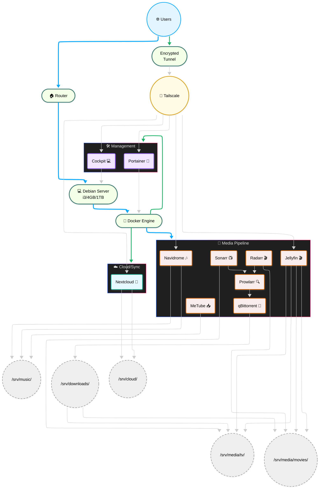

## 🏗️ Complete System Architecture

```mermaid
---
config:
  layout: elk
  theme: neo-dark
  look: neo
---
graph TB
 subgraph MEDIA["🎥 Media Pipeline"]
    direction TB
        MeTube("MeTube 📥")
        Navidrome("Navidrome 🎶")
        Prowlarr("Prowlarr 🔍")
        Sonarr("Sonarr 📺")
        Radarr("Radarr 🎬")
        qBittorrent("qBittorrent 🌊")
        Jellyfin("Jellyfin 🎬")
  end
 subgraph CLOUDSYNC["☁️ Cloud/Sync"]
        Nextcloud("Nextcloud 📁")
  end
 subgraph MGMT["🛠️ Management"]
        Portainer("Portainer 🐳")
        Cockpit("Cockpit 💻")
  end
    Internet(("🌐 Users")) --> Router(["🏠 Router"]) & Tunnel(["Encrypted<br>Tunnel"])
    Router --> Server(["💻 Debian Server<br>i3/4GB/1TB"])
    Server --> Docker(["🐳 Docker Engine"])
    Docker --> MEDIA & CLOUDSYNC & MGMT
    Tunnel --> User(("🔗 Tailscale"))
    Navidrome --> Music(("/srv/music/")) & Music
    Sonarr --> TV(("/srv/media/tv/")) & Prowlarr
    Radarr --> Movies(("/srv/media/movies/")) & Prowlarr
    Jellyfin --> TV & Movies & TV & Movies
    Prowlarr --> qBittorrent
    qBittorrent --> Downloads(("/srv/downloads/"))
    Downloads --> TV & Movies
    Nextcloud --> Cloud(("/srv/cloud/")) & Cloud
    Portainer --> Docker
    Cockpit --> Server
    User --> Jellyfin & Navidrome & Nextcloud & Portainer & Cockpit
    MeTube --> Music
     MeTube:::media
     Navidrome:::media
     Prowlarr:::media
     Sonarr:::media
     Radarr:::media
     qBittorrent:::media
     Jellyfin:::media
     Nextcloud:::cloud
     Portainer:::mgmt
     Cockpit:::mgmt
     Internet:::source
     Router:::infra
     Tunnel:::infra
     Server:::infra
     Docker:::infra
     User:::client
     Music:::storage
     TV:::storage
     Movies:::storage
     Downloads:::storage
     Cloud:::storage
    classDef source fill:#e3f6ff,stroke:#08a8ff,stroke-width:2px
    classDef infra fill:#f3ffe6,stroke:#48807a,stroke-width:2.5px
    classDef client fill:#fffbe6,stroke:#dbaa2f,stroke-width:2.5px
    classDef media fill:#f9ecec,stroke:#de6800,stroke-width:2px
    classDef cloud fill:#e9faff,stroke:#25b89b,stroke-width:2px
    classDef mgmt fill:#f0e6ff,stroke:#9966ff,stroke-width:2px
    classDef storage fill:#eeeeee,stroke:#666,stroke-dasharray: 6 4
    style MeTube color:#000000
    style Navidrome color:#000000
    style Prowlarr color:#000000
    style Sonarr color:#000000
    style Radarr color:#000000
    style qBittorrent color:#000000
    style Jellyfin color:#000000
    style Nextcloud color:#000000
    style Portainer color:#000000
    style Cockpit color:#000000
    style Internet color:#000000
    style Router color:#000000
    style Tunnel color:#000000
    style Server color:#000000
    style Docker color:#000000
    style User color:#000000
    style Music color:#000000
    style TV color:#000000
    style Movies color:#000000
    style Downloads color:#000000
    style Cloud color:#000000
    linkStyle 0 stroke:#08a8ff,stroke-width:3px,fill:none
    linkStyle 1 stroke:#1cb567,stroke-width:2.5px,fill:none
    linkStyle 2 stroke:#08a8ff,stroke-width:3px,fill:none
    linkStyle 3 stroke:#08a8ff,stroke-width:3px,fill:none
    linkStyle 4 stroke:#08a8ff,stroke-width:3px,fill:none
    linkStyle 5 stroke:#1cb567,stroke-width:2.5px,fill:none
    linkStyle 6 stroke:#1cb567,stroke-width:2.5px,fill:none
```