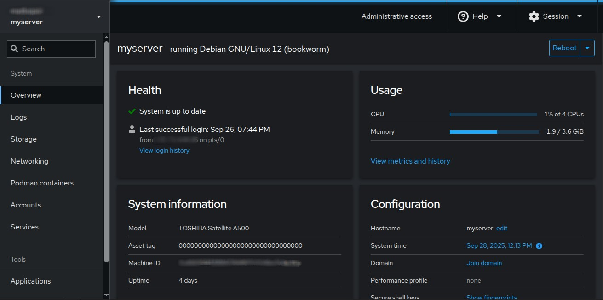

# Cockpit - Server Management

Web-based system administration interface for Linux servers.

## Quick Deploy
```bash
docker-compose up -d
```
**Access:** https://myserver:9090



## Features
- System performance monitoring
- Service management
- User account management
- Network configuration
- Storage management
- Terminal access

## Usage
- **System**: CPU, memory, disk usage
- **Services**: Start/stop system services
- **Networking**: Network interface management
- **Storage**: Disk and filesystem management
---
_Part of my [homelab project](../../README.md)._