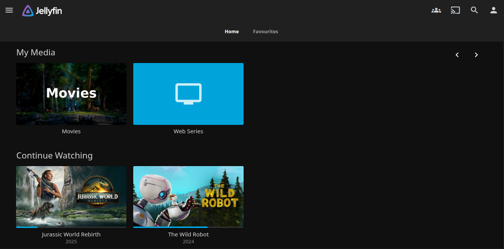

# Jellyfin Media Server

Self-hosted Netflix alternative for movies and TV shows.

## Quick Deploy
```bash
docker-compose up -d
```
**Access**: http://myserver:8096



## My Setup
- **Library**: `/srv/media/movies` and `/srv/media/tv`
- **Hardware Transcoding**: Enabled (Intel i3 4th Gen Quick Sync)
- **Clients**: Web, Android TV, Mobile apps
- **Automation**: Fed by Sonarr/Radarr Arr stack

Checkout the [architecture](/architecture/) files for better understanding.

## Configuration
See [docker-compose file](./docker-compose.yml) for volume mounts and transcoding settings.

## Integration
- **Source**: Sonarr/Radarr download to library folders
- **Access**: Direct or via reverse proxy
- **Users**: Family members with separate watch progress
---
_Part of my [homelab project](../README.md)._


