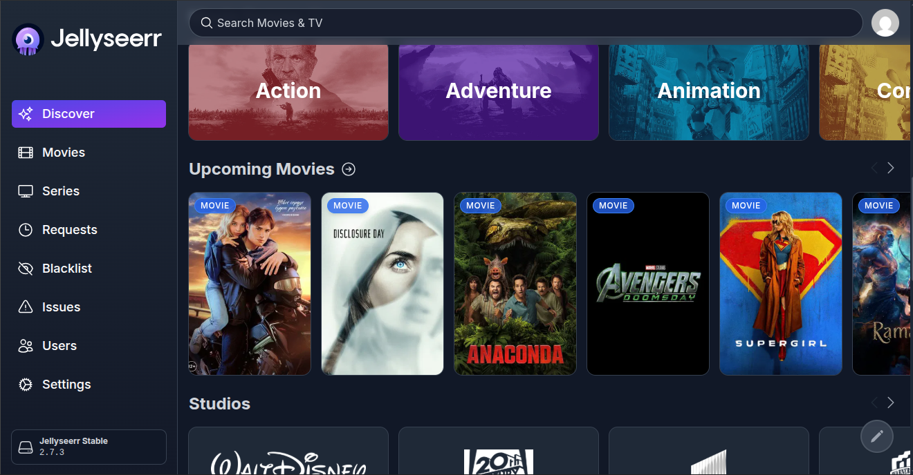

# **Jellyseerr**

Provides a user-friendly, "Netflix-style" interface to discover and request movies/TV shows without accessing the backend Arrs.

## Quick Deploy
```bash
docker-compose up -d
```
**Access:** https://myserver:5055



## **Features** 
- **Request Management:** One-click requests for movies and series.

* **Auto-Approve:** Automatically triggers downloads for trusted users.
* **Discovery:** Shows trending content, similar titles, and trailers.
* **Jellyfin Login:** Uses Jellyfin for authentication and library syncing.

## **Service Flow** 
User Request → **Jellyseerr** → Sonarr/Radarr → qBittorrent → **Jellyfin** (Ready to watch).

## **Docker Compose Highlights** 
* **Location:** Resides in the main `/srv/media/` compose file.

* **Volume:** `/srv/media/config/jellyseerr:/app/config`.

* **Network:** Uses Docker internal service names (`sonarr`, `radarr`) for communication.

## **Integrations** 
* **Jellyfin:** Connects via Server IP:8096 to check existing library.

* **Radarr/Sonarr:** Linked via API keys to automate the "2GB Max" download policy.

## **Key Points to Keep in Mind** 
* **Library Sync:** _If_ new content doesn't show up, trigger a manual "Scan Library" in Jellyseerr settings.

* **API Keys:** If you change the password for Sonarr/Radarr, you must update the API keys in Jellyseerr.

---
_Part of my [homelab project](../../README.md)._