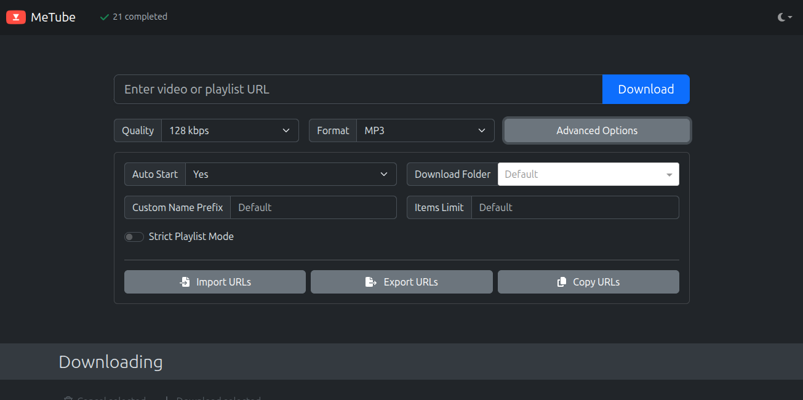

# MeTube - YouTube Audio Downloader

Simple web interface for downloading audio from YouTube and YouTube Music.

## Quick Start
```bash
docker-compose up -d
```
Access: http://your-server:5001



## Features
- Download audio from YouTube/YT Music
- Convert to MP3 format automatically  
- Simple web interface
- Password protected access

## Usage
1. Paste YouTube/YT Music URL
2. Select audio format (MP3 recommended)
3. Download starts automatically
4. Files saved to `/srv/music/` for Navidrome

## Integration
- **Destination**: `/srv/music/` (Navidrome library)
- **Access**: Password protected via reverse proxy
- **Format**: Auto-converts to MP3 for compatibility

Part of my [homelab project](../README.md).
