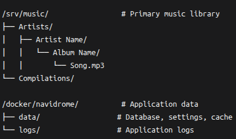

# Navidrome Music Server

> Personal Spotify alternative - ad-free, privacy-focused, and self-hosted

## 🎯 Purpose
Navidrome provides a modern music streaming server that replaces commercial services like YouTube Music and Spotify. Born from the need to avoid ads and background play restrictions, it now serves as the cornerstone of my homelab's media ecosystem.

## ✨ Features
- **Web-based music player** with modern UI
- **Mobile app support** (Substreamer, Play:Sub, etc.)
- **Subsonic API compatible** - works with many existing clients
- **Automatic library scanning** - new music appears automatically
- **Multi-user support** with separate libraries and preferences
- **Transcoding on the fly** for format compatibility

## 🏗️ Architecture
```
Coming soon
```
## 📁 Directory Structure


## Access
**Web UI:** http://server-ip:4533

**First-time setup:** Create admin account on initial access

## ⚙️ Configuration Environment Variables

See [Docker .yml file](./docker-compose.yml) here.

See [environment file](./.env.example). for all configuration options.


**Key settings:**
```
ND_SCANSCHEDULE=1h - Library scan interval

ND_LOGLEVEL=info - Logging level

ND_BASEURL=/ - Base URL for reverse proxy
```
## ❓ Troubleshooting Common Issues
**Music not appearing:** Run manual scan or check file permissions

**Playback errors:** Verify audio file formats (MP3, FLAC, OGG supported)

**Login issues:** Check user permissions in admin interface

## Performance Tips
- Keep music files organized in Artist/Album structure

- Use MP3 format for best compatibility

- Ensure adequate storage space for music library

## 📈 Metrics & Monitoring
- **Active users:** 1-3 concurrent streams

- **Library size:** 31

- **Uptime:** 95% (since Sep 2025)