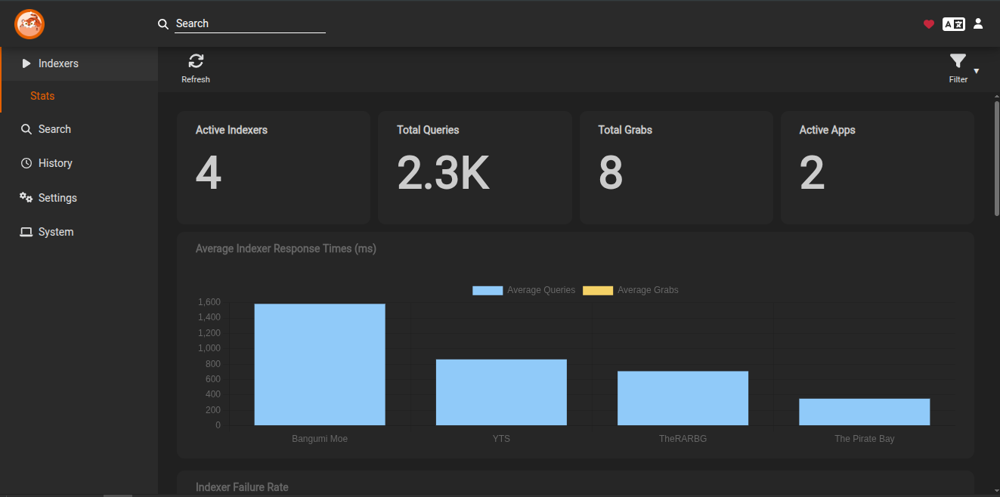

# Prowlarr - Indexer Manager

**Part of the [Arr Stack](../arr-stack/)**

## Purpose
Unified indexer management for Sonarr and Radarr.

## Access
- **Web UI**: http://myserver:9696
- **Default credentials**: None (set on first access)

## Integration
- **Clients**: Sonarr, Radarr
- **Function**: Centralized tracker/indexer configuration

## Configuration
See [docker-compose.yml](../arr-stack/docker-compose.yml) for volume mounts and settings.