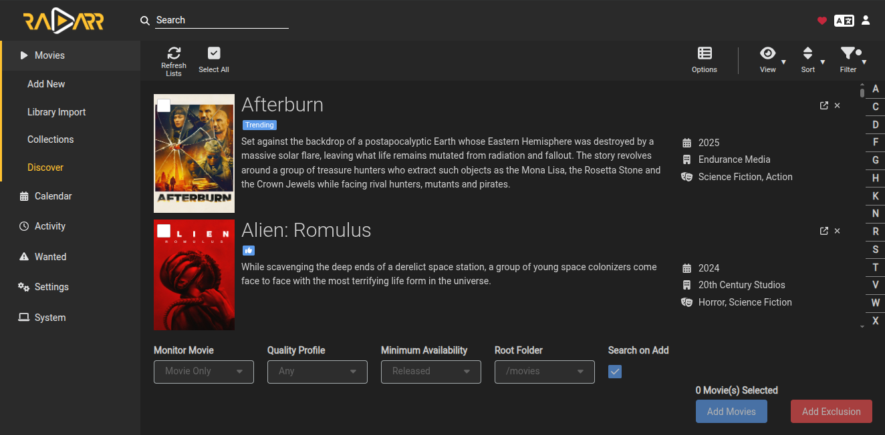

# Radarr - Movie Automation

**Part of the [Arr Stack](../arr-stack/)**

## Purpose  
Automated movie management - finds, downloads, and organizes films.

## Access
- **Web UI**: http://myserver:7878
- **Default credentials**: None (set on first access)

## Integration
- **Source**: Prowlarr indexers
- **Download**: qBittorrent client
- **Destination**: Jellyfin movie library (`/srv/media/movies`)

## Configuration
See [docker-compose.yml](../arr-stack/docker-compose.yml) for volume mounts and settings.

