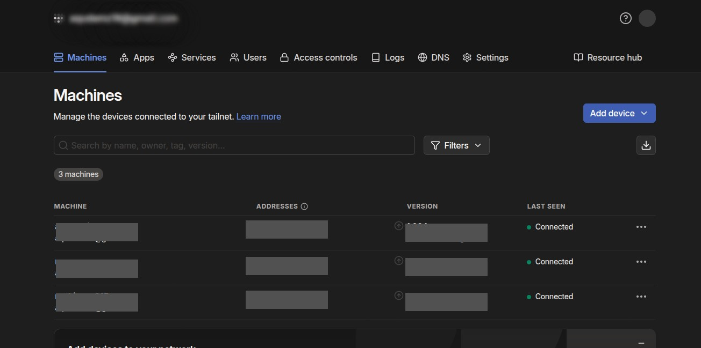

# Tailscale - Secure VPN Access

Zero-config VPN for secure remote access to your homelab.

## Installation
```bash
# On server
curl -fsSL https://tailscale.com/install.sh | sh
sudo tailscale up

# On client devices: Install Tailscale app and login
```



## Features
- Secure remote access from anywhere
- No port forwarding required
- Device-to-device encrypted tunnels
- MagicDNS for easy service access
- You just need internet access on the server, tailscale looks after all the remote access cofiguration

## Usage
- Access services via `http://server-tailscale-ip:port`
- Use MagicDNS: `http://server-name.tailnet.ts.net`
- Manage devices via https://login.tailscale.com

---
_Part of my [homelab project](../../README.md)._